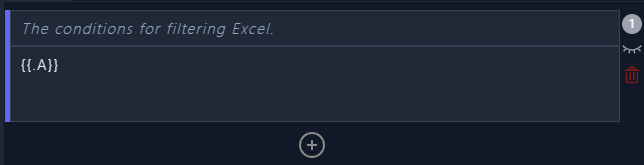

ExcelMate 应用用于处理 Excel 文件，包含 csv 格式，可使用多种简单的条件搜索数据，并将不同条件的 Excel 数据定制输出为自己想要的数据格式。


# ExcelMate 教程

* [界面](#界面)
* [案例数据](#案例数据)
* [条件语法](#条件语法)
    * [列名](#列名)
    * [数字列](#数字列)
    * [大于](#大于)
    * [小于](#小于)
    * [大于等于](#大于等于)
    * [小于等于](#小于等于)
    * [等于](#等于)
    * [不等于](#不等于)
    * [模糊匹配](#模糊匹配)
    * [多条件满足](#多条件满足)
    * [多条件有一个满足](#多条件有一个满足)
* [模板语法](#模板语法)
    * [Beancount](#Beancount)
    * [格式化时间](#格式化时间)
    * [去除前后多余数据](#去除前后多余数据)

## 界面
打开后右上角两个数据框，上面写条件，下面写模板。



## 案例数据
假设 Excel 数据如下：

A | B | C | D
--- | --- | --- |----
时间 | 交易对象 | 金额 | 描述
2022-02-08 | 建设银行 | 20 | 我还款了
2022-03-08 | 招商银行 | -20 | 我借钱了


## 条件语法

### 列名

`A - Z` 的大写字母名称表示对应哪一列的数据。

### 数字列

如果某一列你认为是数字，则需要 `number(C)` 这样写，表示 C 列是数字。

### 大于 

`number(C) > 0` 查找 C 列大于 0 的数据。


### 小于

`number(C) < 0` 查找 C 列小于 0 的数据。

### 大于等于

`number(C) >= 0` 查找 C 列大于等于 0 的数据。


### 小于等于

`number(C) <= 0` 查找 C 列小于等于 0 的数据。


### 等于

` B == "建设银行" ` 查找 B 列为 “建设银行” 的数据。

### 不等于

`B != "建设银行"` 查找 B 列不是 “建设银行” 的数据。


### 模糊匹配

` D matches "还款"` 模糊匹配 D 列数据中包含 “还款” 字样的数据。

### 多条件满足

` B == "建设银行" and D matches "还款"` 使用 `and` 表示这两个条件都满足。

### 多条件有一个满足

` B == "建设银行" or D matches "还款"` 使用 `or` 表示这两个条件有一个满足就行。

## 模板语法
模板的作用是拿条件匹配的数据组装自己想要的最终内容。

模版完整语法请看：
* [template package - text/template - Go Packages](https://pkg.go.dev/text/template)
* [masterminds.github.io/sprig/](http://masterminds.github.io/sprig/)

当然看这个会很复杂，我简单列举下常见的使用 。

`{{.A}}` 使用双括号、英文句号、列名组装一块，表示取出 A 列的数据。 
### Beancount
拿 Beancount 格式举个例子。
```
{{.A}} * "{{.B}}" "{{.D}}" 
    Expenses:Others              {{.G}} CNY
    Assets:Card:CCB
```

### 格式化时间
如果 Excel 中的时间不是自己想要的格式，有两种办法解决。

1. 使用 Excel 软件处理好。
2. 使用 模板语法。

展开说说模板语法:

* 数据 `2023-01-27 19:51:41`，目标 `2023-01-27`，模板语法 `{{toDate "2006-01-02 15:04:05" .A | date "2006-01-02"}}`

### 去除前后多余数据
假如 A 列的数据类似 `服务费¥20.12`,但你只想要其中的数字。
* `{{trimPrefix "服务费¥" .A}}` 去除前面 “服务费¥” 字符
* `{{trimSuffix "后面字符" .A}}` 去除后面的字符
* `{{trimAll "前后字符" .A}}` 去除前面和后面的字符

### 自由截取数据

假设 A 列有一串数据 `2023-01-27 19:51:41`，我只想要 `2023-01-27` 数据，那从 0(第一位) 开始数到空格(27后面)位置 10，模板语法 `{{substr 0 10 .A}}`

* 数据 `服务费¥20.12`，只要 `20.12`，但可能数字位置的长度不一定，例如：`服务费¥200.12`,模板语法 `{{substr 4 -1 .A}}`
* `{{substr [start] [end] 数据}}` start 和 end 表示起始索引(从0开始的位置编号)，如果为 -1 则表示最开头或最结尾。


 

# TODO
- [ ] 发布 Mac 版本
- [ ] 增加输出结果下载
- [ ] 窗口尺寸调节
